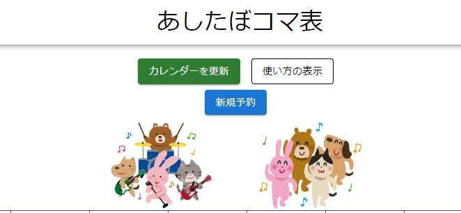

# いざコード編集してみよう - Docker開発編
では！ここからは実際にファイルを編集していってどんな変更を加えれば、Webページにどんな変化が起こるか見ていきましょう。

## はじめに
まず、この資料では実際にコードに変更を加えてその変更を確かめるので
```bash
make renew
```
を実行してから、コードを変更していきましょう。

また、コードの変更を加えると「ソース管理」タブに変更が出てきますがここで変更したコードは、リポジトリにコミットやプッシュをしないようにしてください。  
「⤴」こんな感じの矢印アイコンをクリックすると今までの変更をすべて戻すことが可能なので、このページの課題が一通り終わったら、もしくは飽きたら、このボタンで今までの変更をなくしちゃいましょう。

あとわかんないことやエラーが出たら、変更したコードと今どういう出力になっているかをスクショしてDiscordで聞いてください。Discordで聞くことでみんなにどういうひっかけがあるか共有できることになるので、そちらでお願いします。

あとこれで合ってんのかわかんないときもわたべに聞いてください。まあこんなことやるなら[progate](https://prog-8.com/)やったほうがはやいんすけどねw

## 課題1 - HTML部分を編集しよう
まずはHTML部分の編集からです。まあてきとーにこなしてください。

### 課題1-1　「使い方の表示」の内容変更
はじめにあしたぼコマ表の「使い方の表示」を押すと出てくる使い方の説明を編集しましょう。内容は何でもいいですが文字列にはしっかり改行をいれたり、画像を入れてみたり、チャレンジできることは何でもしましょう。どこかに平文で書いてあるので探してみてください。

### 課題1-2　ボタンを押したときの挙動の変更
「使い方の表示」ボタンは現状、おすとさっき編集した使い方のページがモーダルウィンドウとして表示されます。これを新規予約ページ(URLでいうとlocalhost:3000/booking/new)に遷移するボタンに変更してみましょう。
こういったボタンは
```tsx
<Button
  variant="outlined"
  color="inherit"
  onClick={() => setIsPopupOpen(true)}
>
  使い方の表示
</Button>
```
こんな感じで実装されていて、このButtonタグを使えば新しいボタンを作ることができます。今回編集するのはこのButtonタグのonClickというところで、ここはボタンがクリックされた時の挙動を書くことができます。この挙動を変更してもらいます。

まず、ちょっと直接教えますがBookingMainPage.tsxの最初のほうの記述を以下のように変更してください
```tsx
'use client'

import { useState, useEffect, useRef } from 'react'
import { useRouter } from 'next/navigation' // ここと
import Image from 'next/image'
import { format } from 'date-fns'
(中略)
import { PiCircle } from 'react-icons/pi'
import { HiMiniXMark } from 'react-icons/hi2'

const ArrayDayList = Array.from({ length: 15 }, (_, i) => i - 1)

const MainPage = () => {
	const today = new Date()
    const router = useRouter() // ここを追加
	(中略)
	const ReadMePopupRef = useRef<PopupRef>(undefined)
```
なにやらrouterという変数が追加されましたね、これが鍵です。BookingMainPage.tsxではこのライブラリを使っていませんがほかのコンポーネントでは使っています。左側の虫眼鏡アイコンをクリックするとそのリポジトリ内での検索が可能なので今追加したコードの単語引っ張り出して検索してみましょう。

一応[公式ドキュメント](https://nextjs.org/docs/pages/api-reference/functions/use-router)も貼っときます。

### 課題1-3 ボタンを追加してみよう
では次に下の画像みたいにボタンを追加してみましょう

使い方の表示ボタンは最初の仕様に戻して、新たにこの下に新規予約と書かれた、localhost:3000/booking/newに遷移するボタンを追加してみましょう。

これ実は少し難しいので下の画像のように横並びでも構いません。色は青にしてみましょう！


え～ヒントは以下のドキュメントを読んでください。英語やけど気合いや  
[Stackタグ](https://mui.com/material-ui/react-stack/)  
[Buttonタグ](https://mui.com/material-ui/react-button/)  

### 課題1-4 ヘッダーを編集してみよう
はいじゃあ今度はヘッダーを編集します。ヘッダーってのはページの一番上についてるやつね、あしたぼコマ表って書いてるやつ。これの色を緑にして、文字をなんか好きなのに変更してみましょう。ちなみにどこのコンポーネントがこれを動かしてるとかはここに書かないので血眼になって探してください。app/layout.tsxにちょっとヒントがあります。


うわ～ぜんぜんかんけーねー

え～ヒントは以下のドキュメントを読んでください。  
[AppBarタグ](https://mui.com/material-ui/react-app-bar/)  
[Typographyタグ](https://mui.com/material-ui/react-typography/)  

まあHTML部分というかデザインはこんなもんでいいでしょう。あとは僕の書いたコードを参考にしたり必死こいてドキュメント読み込んだりエラーにキレ散らかしたりしてください。

## 課題2 - Reactの機能をめっちゃ使ってみよう
